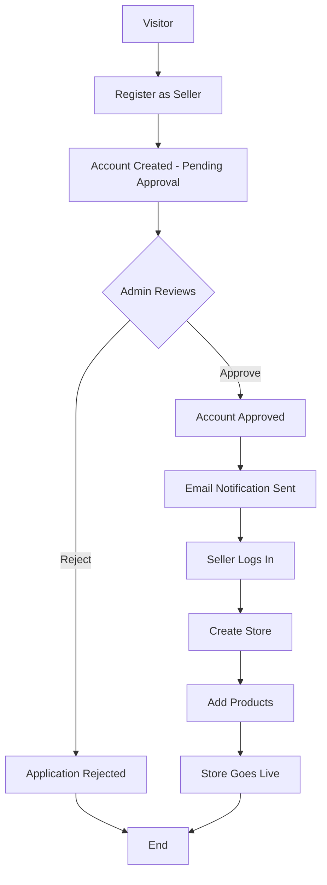
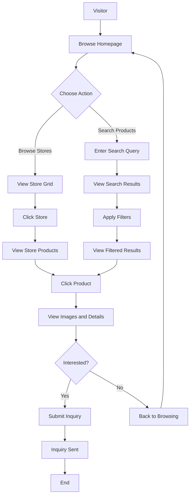

# Product Requirements Document (PRD)
# Sellor - Multi-Store E-Commerce Platform

**Version:** 1.0  
**Date:** January 26, 2026  
**Status:** Draft  
**Target Market:** Southeast Asia

---

## 1. Executive Summary

### Product Vision
Sellor is a web-based multi-store e-commerce platform that empowers small sellers and individuals in Southeast Asia to create their own online shops without technical expertise or the cost of building a custom website. By providing a centralized marketplace where sellers can easily set up stores, list products, and connect with buyers, Sellor aims to democratize online selling.

### Goals
- **For Sellers:** Provide a simple, no-code solution to establish an online presence and manage products through an intuitive dashboard
- **For Buyers:** Offer a unified platform to discover diverse products from multiple independent sellers with powerful search and filtering capabilities
- **For the Platform:** Build a scalable, community-driven marketplace that supports small business growth in Southeast Asia

### Value Proposition

**For Sellers:**
- Zero setup costs - no need to build or maintain a website
- Unique public URL for each store (e.g., `sellor.com/store/ShoeSeller101`)
- Easy product management with images, categories, and inventory tracking
- Direct buyer communication through inquiry system
- Mobile-friendly seller dashboard

**For Buyers:**
- Discover products from multiple sellers in one place
- Advanced search and filtering (by category, price, condition)
- Detailed product information with multiple images
- Direct contact with sellers for questions and negotiations

### Success Metrics (MVP - First 3 Months)
- **50+ active sellers** with live stores
- **500+ products** listed across all stores
- **2,000+ monthly visitors** to the platform
- **200+ inquiries** submitted by buyers
- **< 5% seller drop-off rate** after store creation

---

## 2. Product Overview

### Problem Statement

Small sellers and individual entrepreneurs in Southeast Asia face significant barriers to selling online:

1. **Technical Complexity:** Building and maintaining a website requires technical skills and ongoing costs
2. **Platform Fees:** Existing marketplaces charge high commissions (10-20%)
3. **Limited Brand Control:** Sellers on large platforms like Shopee/Lazada lose brand identity
4. **Discovery Challenges:** Independent websites struggle with SEO and customer acquisition
5. **Resource Constraints:** Small sellers can't afford e-commerce developers or monthly hosting fees

### Solution

Sellor provides a centralized, free-to-use platform where sellers can:
- Register and create a branded store in minutes
- List products with categories, images, and detailed descriptions
- Receive a unique public URL that's easy to share
- Manage inventory and inquiries through a simple dashboard
- Connect directly with interested buyers

The platform handles all technical infrastructure while giving sellers control over their store presentation and product organization.

### Key Differentiators

| Feature | Sellor | Traditional E-Commerce | Marketplace Platforms |
|---------|--------|------------------------|----------------------|
| Setup Cost | Free | $500-$5,000+ | Free (but high commissions) |
| Technical Skills Required | None | High | Low |
| Brand Control | High (unique store URL) | Full | Low (generic listings) |
| Commission Fees (MVP) | 0% | N/A | 10-20% |
| Time to Launch | < 30 minutes | Days to weeks | Hours |
| Store Customization | Moderate | Full | Minimal |

### Business Model

**MVP Phase:** Free for all users (no commissions or subscription fees)

**Future Monetization (Post-MVP):**
- **Commission Model:** 3-5% commission on completed orders
- **Premium Subscriptions:** 
  - Featured store placement
  - Advanced analytics dashboard
  - Priority support
  - Custom store themes
- **Promotional Services:** Sponsored product listings, banner ads

---

## 3. User Personas & Use Cases

### Primary Personas

#### Persona 1: Small Seller - "Nisa" (Target User)
- **Age:** 28
- **Occupation:** Part-time online seller (handmade jewelry)
- **Location:** Bangkok, Thailand
- **Tech Savvy:** Moderate (uses social media, unfamiliar with web development)
- **Pain Points:** 
  - Currently sells on Instagram but wants a more professional presence
  - Can't afford to hire a developer
  - Difficult to manage inventory via Instagram DMs
- **Goals:**
  - Create an online store that looks professional
  - Organize products by collection (necklaces, bracelets, earrings)
  - Share a single URL instead of multiple Instagram posts
- **Usage Pattern:** Logs in 2-3 times per week to add new products and respond to inquiries

#### Persona 2: Buyer - "David" (Customer)
- **Age:** 24
- **Occupation:** University student
- **Location:** Chiang Mai, Thailand
- **Tech Savvy:** High
- **Pain Points:**
  - Wants to support small businesses but hard to discover them
  - Prefers consolidated browsing over jumping between individual websites
  - Needs detailed product information before purchasing
- **Goals:**
  - Find unique products not available on major platforms
  - Compare products across multiple sellers
  - Contact sellers directly with questions
- **Usage Pattern:** Browses weekly, searches for specific products, contacts 2-3 sellers per month

#### Persona 3: Platform Admin - "Siri" (Operator)
- **Age:** 32
- **Occupation:** Platform operations manager
- **Tech Savvy:** High
- **Responsibilities:**
  - Review and approve seller applications
  - Moderate content for policy violations
  - Monitor platform health and user activity
  - Handle disputes and support escalations
- **Goals:**
  - Maintain platform quality and trust
  - Prevent spam and fraudulent sellers
  - Ensure smooth user experience
- **Usage Pattern:** Daily monitoring and management tasks

### Key Use Cases

#### Use Case 1: Seller Registration & Store Creation
**Actor:** New Seller (Nisa)  
**Preconditions:** None  
**Main Flow:**
1. Nisa navigates to Sellor homepage
2. Clicks "Become a Seller" and fills registration form (username, email, password, phone)
3. Submits seller application with brief description of business
4. Admin reviews and approves application within 24 hours
5. Nisa receives approval email and logs in
6. Creates store by entering store name, slug, description, and uploading logo
7. Store is live at `sellor.com/store/nisa-jewelry`

**Success Criteria:** Store is created and accessible via public URL

#### Use Case 2: Product Listing & Management
**Actor:** Seller (Nisa)  
**Preconditions:** Seller has approved account and active store  
**Main Flow:**
1. Nisa logs into seller dashboard
2. Navigates to "Add Product" page
3. Fills in product details:
   - Title: "Handmade Silver Bracelet"
   - Description: "Sterling silver bracelet with gemstone..."
   - Price: 850 THB
   - Stock: 5 units
   - Category: "Bracelets"
4. Uploads 4 product images and sets display order
5. Sets status to "Active"
6. Saves product

**Alternative Flows:**
- Edit existing product to mark as "Sold"
- Delete product listing
- Create product group/category for better organization

**Success Criteria:** Product appears in store and is searchable by buyers

#### Use Case 3: Product Discovery & Search
**Actor:** Buyer (David)  
**Preconditions:** None (public access)  
**Main Flow:**
1. David visits Sellor homepage
2. Browses featured stores on homepage
3. Uses search bar to search for "silver bracelet"
4. Applies filters:
   - Price range: 500-1,000 THB
   - Category: Jewelry
5. Views search results with product thumbnails
6. Clicks on Nisa's "Handmade Silver Bracelet"
7. Views detailed product page with all images, description, price, seller info

**Success Criteria:** David finds relevant products within 30 seconds

#### Use Case 4: Buyer Inquiry
**Actor:** Buyer (David)  
**Preconditions:** David is viewing a product page  
**Main Flow:**
1. David clicks "Contact Seller" button on product page
2. Fills inquiry form:
   - Name: David Chen
   - Email: david@example.com
   - Message: "Do you ship to Chiang Mai? What's the shipping cost?"
3. Submits inquiry
4. Receives confirmation message
5. Nisa receives email notification about new inquiry
6. Nisa logs in, views inquiry in dashboard, and marks as "Replied" after responding via email

**Success Criteria:** Inquiry is delivered to seller and tracked in system

#### Use Case 5: Admin Moderation
**Actor:** Admin (Siri)  
**Preconditions:** Admin is logged in  
**Main Flow:**
1. Siri accesses admin panel
2. Reviews pending seller applications
3. Checks seller's business description and background
4. Approves legitimate seller or rejects suspicious applications
5. Monitors reported products for policy violations
6. Hides inappropriate product listings if needed

**Success Criteria:** Platform maintains quality through effective moderation

---

## 4. MVP Feature Requirements

### Feature Prioritization Matrix

| Feature | Priority | Effort | MVP Status |
|---------|----------|--------|------------|
| User Registration & Auth | Must Have | Medium | ✅ Include |
| Role-based Access Control | Must Have | Medium | ✅ Include |
| Seller Approval Workflow | Must Have | Low | ✅ Include |
| Store Creation & Management | Must Have | Medium | ✅ Include |
| Product CRUD Operations | Must Have | High | ✅ Include |
| Product Image Upload | Must Have | High | ✅ Include |
| Product Categories/Groups | Must Have | Medium | ✅ Include |
| Store Public Pages | Must Have | High | ✅ Include |
| Product Search | Must Have | High | ✅ Include |
| Product Filtering | Should Have | Medium | ✅ Include |
| Inquiry System | Must Have | Medium | ✅ Include |
| Admin User Management | Must Have | Low | ✅ Include |
| Admin Content Moderation | Should Have | Medium | ✅ Include |
| Shopping Cart | Nice to Have | High | ❌ Post-MVP |
| Checkout & Orders | Nice to Have | High | ❌ Post-MVP |
| Payment Integration | Nice to Have | High | ❌ Post-MVP |
| Order Tracking | Nice to Have | Medium | ❌ Post-MVP |
| Product Reviews | Nice to Have | Medium | ❌ Post-MVP |
| Seller Analytics | Nice to Have | Medium | ❌ Post-MVP |

### 4.1 Authentication & User Management

**Must-Have Features:**

- **User Registration**
  - Fields: username (unique), email (unique), password, phone (optional)
  - Role selection: Buyer or Seller (Admin assigned manually)
  - Email validation
  - Password strength requirements (min 8 chars, 1 uppercase, 1 number)

- **Login/Logout**
  - JWT-based authentication
  - Token expiration: 24 hours
  - "Remember me" option (30-day token)
  - Password reset via email (Post-MVP: nice to have)

- **Seller Approval Workflow**
  - Sellers start with `selling_approve: false`
  - Sellers can view platform but cannot create stores until approved
  - Admin reviews applications and sets `selling_approve: true`
  - Email notification sent upon approval

- **Role-Based Access Control (RBAC)**
  - **Buyer:** View stores/products, submit inquiries
  - **Seller:** All buyer permissions + manage own store, products, view inquiries
  - **Admin:** All permissions + approve sellers, moderate content, view all data

**Acceptance Criteria:**
- New users can register and receive confirmation email
- Users can log in with credentials and receive JWT token
- Sellers cannot create stores until admin approval
- Each role has correct permissions enforced at API level

### 4.2 Store Management (Seller Dashboard)

**Must-Have Features:**

- **Store Creation**
  - Fields:
    - Store name (required, max 100 chars)
    - Slug (required, unique, URL-friendly, e.g., "nisa-jewelry")
    - Description (optional, max 1000 chars, supports line breaks)
    - Logo URL (optional, image upload)
  - Validation: Slug must be unique across all stores
  - Constraint: One store per seller (enforced at DB level)

- **Store Editing**
  - Sellers can update store name, description, and logo
  - Cannot change slug after creation (prevents broken links)
  - Changes reflect immediately on public store page

- **Store Dashboard Overview**
  - Total products count
  - Active products count
  - Total inquiries received
  - Recent inquiries (last 5)

**Acceptance Criteria:**
- Approved sellers can create exactly one store
- Store is accessible at `/store/{slug}` immediately after creation
- Sellers can edit store details anytime
- Dashboard shows real-time statistics

### 4.3 Product Catalog Management

**Must-Have Features:**

- **Product Creation**
  - Fields:
    - Title (required, max 200 chars)
    - Description (optional, max 5000 chars, rich text or markdown)
    - Price (required, decimal, positive number)
    - Stock quantity (optional, integer, default: null for unlimited)
    - Status (required, enum: "active" | "sold" | "hidden", default: "active")
    - Product group/category (optional, dropdown of seller's categories)
  - Validation: All fields validated on frontend and backend

- **Product Image Management**
  - Upload up to 5 images per product
  - Supported formats: JPEG, PNG, WebP
  - Max file size: 5MB per image
  - Image position/ordering (0-indexed)
  - First image (position 0) is thumbnail
  - Images stored with unique filenames

- **Product Editing**
  - Edit all product fields
  - Add/remove images
  - Reorder images via drag-and-drop
  - Mark product as sold (status: "sold")
  - Hide product (status: "hidden") - not visible to buyers

- **Product Deletion**
  - Soft delete recommended (archive instead of hard delete)
  - Confirmation dialog before deletion
  - Cannot delete if referenced by inquiries (show warning)

- **Product Categories/Groups**
  - Create custom categories within store (e.g., "Necklaces", "Bracelets")
  - Unique category names per store
  - Assign products to categories (optional)
  - Uncategorized products allowed

**Acceptance Criteria:**
- Sellers can create products with all required fields
- Images upload successfully and display in correct order
- Product status changes reflect immediately
- Categories help organize products within store
- Product list view shows thumbnail, title, price, stock, status

### 4.4 Buyer Experience - Public Store & Product Pages

**Must-Have Features:**

- **Marketplace Homepage**
  - Featured/newest stores (grid layout)
  - Store cards show: logo, name, description (truncated), product count
  - "View Store" button links to store page

- **Store Public Page** (`/store/{slug}`)
  - Store header: logo, name, full description
  - Products grid (active products only)
  - Product cards show: thumbnail, title, price, "View Details" button
  - Filter products by category (sidebar or dropdown)
  - Responsive layout (mobile and desktop)

- **Product Detail Page** (`/product/{id}`)
  - Image gallery with thumbnail navigation
  - Product title, price, description (formatted)
  - Stock status (e.g., "5 available" or "Out of stock")
  - Category badge
  - Seller information (store name, link to store)
  - "Contact Seller" button (opens inquiry form)

- **Responsive Design**
  - Mobile-first approach
  - Touch-friendly navigation on mobile
  - Optimized images for different screen sizes

**Acceptance Criteria:**
- Store pages load within 3 seconds
- Product images display correctly on all devices
- Navigation is intuitive and accessible
- Hidden/sold products are not visible to buyers

### 4.5 Product Search & Filtering

**Must-Have Features:**

- **Global Product Search**
  - Search bar in header (available on all pages)
  - Search by product title and description
  - Real-time search suggestions (nice to have)
  - Search results page with grid layout

- **Advanced Filtering**
  - Filter by:
    - Price range (min/max sliders)
    - Category (multi-select)
    - Store (multi-select)
  - "Clear all filters" option
  - Filter count indicator (e.g., "3 filters applied")

- **Sorting Options**
  - Newest first (default)
  - Price: Low to High
  - Price: High to Low
  - Alphabetical (A-Z)

- **Pagination**
  - 20 products per page
  - Page numbers with prev/next buttons
  - Show total results count

**Technical Requirements:**
- Database indexes on `products.title` and `products.price`
- Full-text search on title and description
- Fast queries (< 1 second for 10,000+ products)

**Acceptance Criteria:**
- Search returns relevant results within 1 second
- Filters work correctly in combination
- Pagination handles large result sets efficiently

### 4.6 Inquiry System

**Must-Have Features:**

- **Buyer - Submit Inquiry**
  - Inquiry form on product detail page
  - Fields:
    - Buyer name (required)
    - Buyer email (required, validated)
    - Message (required, max 1000 chars)
  - Captcha to prevent spam (optional but recommended)
  - Success message after submission

- **Seller - View & Manage Inquiries**
  - Inquiries list in seller dashboard
  - Columns: product, buyer name, message preview, status, date
  - Filter by status (new/replied/closed)
  - Sort by date (newest first)
  - Click to view full inquiry details
  - Update status dropdown (new → replied → closed)
  - Link to product page

- **Email Notifications**
  - Seller receives email when new inquiry is submitted
  - Email includes: product name, buyer name, email, message
  - Link to view inquiry in dashboard

- **Inquiry Status Workflow**
  - **New:** Initial state when buyer submits
  - **Replied:** Seller has responded (manually marked)
  - **Closed:** Inquiry resolved (seller marks as closed)

**Acceptance Criteria:**
- Buyers can submit inquiries on any product
- Sellers receive email notifications within 5 minutes
- Sellers can view, filter, and update inquiry status
- Inquiry count updates in dashboard

### 4.7 Admin Panel

**Must-Have Features:**

- **User Management**
  - View all users (paginated table)
  - Columns: ID, username, email, role, approval status, join date
  - Search users by username or email
  - Filter by role (buyer/seller/admin)
  - View user details (stores, products, inquiries)

- **Seller Approval**
  - Pending sellers list
  - View seller application (username, email, phone)
  - "Approve" or "Reject" buttons
  - Rejection reason (optional)
  - Email notification sent on decision

- **Store & Product Moderation**
  - View all stores (list with search)
  - View all products (list with search)
  - Hide/unhide stores or products
  - View flagged content (nice to have: reporting system)
  - Ban users (disable account)

- **Platform Statistics Dashboard**
  - Total users (buyers/sellers/admins)
  - Total stores
  - Total products
  - Inquiries per day (chart)
  - Recent activity feed

**Acceptance Criteria:**
- Admin can approve/reject seller applications
- Admin can view and moderate all content
- Statistics update in real-time
- Admin actions are logged (audit trail)

---

## 5. Out of Scope for MVP

The following features are defined in the database schema but will be implemented **post-MVP** to keep the initial launch focused:

### Order & Checkout System
- Shopping cart functionality
- Multi-item checkout flow
- Order placement and order number generation
- Order management for buyers and sellers
- Order status tracking (placed → paid → packing → shipped → delivered)
- Order history for buyers

### Payment Integration
- Payment gateway integration (credit card, PayPal, PromptPay, Thai bank transfers)
- Payment confirmation and reconciliation
- Refund processing

### Shipping & Logistics
- Saved shipping addresses for buyers
- Shipment tracking with carrier integration
- Delivery confirmation
- Shipping cost calculation

### Advanced Features (Post-MVP)
- Product reviews and ratings
- Seller analytics dashboard
- Wishlist functionality
- Social media integration
- Multi-language support (Thai, English)
- Mobile applications (iOS/Android)

**Rationale:** The MVP focuses on the core value proposition - enabling sellers to create stores and connect with buyers through inquiries. Order processing adds significant complexity and can be validated after proving product-market fit.

---

## 6. Technical Requirements

### 6.1 Technology Stack

#### Frontend
- **Framework:** React 19 (latest stable)
- **Language:** TypeScript
- **Build Tool:** Vite 7.x
- **Routing:** React Router v6
- **State Management:** 
  - React Context API for authentication
  - Zustand or Jotai for complex state (if needed)
- **UI Library:** 
  - **Option 1:** Tailwind CSS + Headless UI (recommended for flexibility)
  - **Option 2:** Material-UI (MUI) v6 (faster development)
- **Form Handling:** React Hook Form + Zod validation
- **HTTP Client:** Axios or native Fetch with wrapper
- **Image Upload:** React Dropzone
- **Rich Text Editor:** TipTap or Quill (for product descriptions)

#### Backend
- **Framework:** FastAPI (Python 3.11+)
- **ORM:** SQLAlchemy 2.x
- **Database:** PostgreSQL 15+
- **Migrations:** Alembic
- **Authentication:** 
  - JWT tokens (PyJWT library)
  - Bcrypt for password hashing
- **Validation:** Pydantic v2 (built-in with FastAPI)
- **CORS:** FastAPI middleware
- **File Upload:** FastAPI file handling + cloud storage
- **Email:** SendGrid or AWS SES (for notifications)

#### Infrastructure
- **Local Development:** Docker Compose
  - PostgreSQL container
  - Backend container (hot reload)
  - Frontend dev server (proxied)
- **Version Control:** Git + GitHub/GitLab
- **Environment Management:** 
  - `.env` files (not committed)
  - Example `.env.example` file committed

#### Storage & CDN
- **Product Images:** 
  - **Option 1:** AWS S3 + CloudFront (scalable, recommended for production)
  - **Option 2:** Cloudinary (easier setup, built-in transformations)
  - **Option 3:** Local filesystem (MVP only, not scalable)

#### Monitoring & Logging (Post-MVP)
- Error tracking: Sentry
- Analytics: Google Analytics or Mixpanel
- Logs: Structured logging (JSON format)

### 6.2 Database Schema

**Schema is defined in** [`backend/database-structure.md`](backend/database-structure.md)

**Key Tables for MVP:**
- `users` - User accounts with roles (buyer/seller/admin)
- `stores` - Seller stores with unique slugs
- `product_groups` - Categories within stores
- `products` - Product listings
- `product_images` - Multiple images per product
- `inquiries` - Buyer-seller communication

**Tables Not Used in MVP (Reserved for Phase 2):**
- `orders`, `order_items`, `order_status_history`
- `shipments`, `addresses`

**Database Indexing Requirements:**
```sql
-- Critical indexes for MVP performance
CREATE INDEX idx_products_title ON products USING gin(to_tsvector('english', title));
CREATE INDEX idx_products_store_status ON products(store_id, status);
CREATE INDEX idx_products_price ON products(price);
CREATE INDEX idx_stores_slug ON stores(slug); -- already unique, but explicit index
CREATE INDEX idx_inquiries_store ON inquiries(store_id, status);
```

### 6.3 API Specifications

**Base URL:** `https://api.sellor.com` (or `http://localhost:8000` for local dev)

**Authentication:** JWT Bearer token in `Authorization` header

**Response Format:** JSON

**Error Format:**
```json
{
  "error": {
    "code": "VALIDATION_ERROR",
    "message": "Invalid input data",
    "details": {
      "email": ["Email already exists"]
    }
  }
}
```

#### Authentication Endpoints

**POST** `/api/auth/register`
- **Description:** Register new user account
- **Auth Required:** No
- **Request Body:**
  ```json
  {
    "username": "nisa_jewelry",
    "email": "nisa@example.com",
    "password": "SecurePass123",
    "role": "seller",
    "phone_number": "+66812345678"
  }
  ```
- **Response:** `201 Created`
  ```json
  {
    "id": 42,
    "username": "nisa_jewelry",
    "email": "nisa@example.com",
    "role": "seller",
    "selling_approve": false,
    "created_at": "2026-01-26T10:30:00Z"
  }
  ```

**POST** `/api/auth/login`
- **Description:** Authenticate user and receive JWT token
- **Auth Required:** No
- **Request Body:**
  ```json
  {
    "email": "nisa@example.com",
    "password": "SecurePass123"
  }
  ```
- **Response:** `200 OK`
  ```json
  {
    "access_token": "eyJhbGciOiJIUzI1NiIsInR5cCI6IkpXVCJ9...",
    "token_type": "bearer",
    "expires_in": 86400,
    "user": {
      "id": 42,
      "username": "nisa_jewelry",
      "role": "seller",
      "selling_approve": true
    }
  }
  ```

**GET** `/api/auth/me`
- **Description:** Get current authenticated user info
- **Auth Required:** Yes
- **Response:** `200 OK`
  ```json
  {
    "id": 42,
    "username": "nisa_jewelry",
    "email": "nisa@example.com",
    "role": "seller",
    "selling_approve": true,
    "store": {
      "id": 15,
      "slug": "nisa-jewelry",
      "name": "Nisa's Handmade Jewelry"
    }
  }
  ```

#### Store Endpoints

**POST** `/api/stores`
- **Description:** Create new store (seller only)
- **Auth Required:** Yes (seller with approval)
- **Request Body:**
  ```json
  {
    "name": "Nisa's Handmade Jewelry",
    "slug": "nisa-jewelry",
    "description": "Handcrafted silver jewelry...",
    "logo_url": "https://cdn.sellor.com/logos/nisa.jpg"
  }
  ```
- **Response:** `201 Created`

**GET** `/api/stores/{slug}`
- **Description:** Get store details and products (public)
- **Auth Required:** No
- **Response:** `200 OK`
  ```json
  {
    "id": 15,
    "slug": "nisa-jewelry",
    "name": "Nisa's Handmade Jewelry",
    "description": "Handcrafted silver jewelry...",
    "logo_url": "https://cdn.sellor.com/logos/nisa.jpg",
    "owner": {
      "username": "nisa_jewelry"
    },
    "product_count": 24,
    "created_at": "2026-01-15T08:00:00Z"
  }
  ```

**PUT** `/api/stores/{id}`
- **Description:** Update own store (owner only)
- **Auth Required:** Yes (owner)
- **Request Body:** Partial update
- **Response:** `200 OK`

**GET** `/api/stores`
- **Description:** List all stores (paginated, public)
- **Auth Required:** No
- **Query Params:** `?page=1&limit=20&sort=newest`
- **Response:** `200 OK` with array of stores

#### Product Endpoints

**POST** `/api/products`
- **Description:** Create new product (seller only)
- **Auth Required:** Yes (seller)
- **Request Body:**
  ```json
  {
    "title": "Handmade Silver Bracelet",
    "description": "Sterling silver bracelet with turquoise gemstone...",
    "price": 850.00,
    "stock": 5,
    "status": "active",
    "group_id": 3,
    "images": [
      {"url": "https://cdn.sellor.com/products/img1.jpg", "position": 0},
      {"url": "https://cdn.sellor.com/products/img2.jpg", "position": 1}
    ]
  }
  ```
- **Response:** `201 Created`

**GET** `/api/products/{id}`
- **Description:** Get product details (public)
- **Auth Required:** No
- **Response:** `200 OK`
  ```json
  {
    "id": 127,
    "title": "Handmade Silver Bracelet",
    "description": "Sterling silver bracelet...",
    "price": 850.00,
    "stock": 5,
    "status": "active",
    "store": {
      "id": 15,
      "slug": "nisa-jewelry",
      "name": "Nisa's Handmade Jewelry"
    },
    "group": {
      "id": 3,
      "name": "Bracelets"
    },
    "images": [
      {"id": 501, "url": "https://cdn.sellor.com/products/img1.jpg", "position": 0},
      {"id": 502, "url": "https://cdn.sellor.com/products/img2.jpg", "position": 1}
    ],
    "created_at": "2026-01-20T14:30:00Z"
  }
  ```

**PUT** `/api/products/{id}`
- **Description:** Update product (owner only)
- **Auth Required:** Yes (store owner)
- **Request Body:** Partial update
- **Response:** `200 OK`

**DELETE** `/api/products/{id}`
- **Description:** Delete product (owner only)
- **Auth Required:** Yes (store owner)
- **Response:** `204 No Content`

**GET** `/api/products`
- **Description:** Search and filter products (public)
- **Auth Required:** No
- **Query Params:**
  - `?search=bracelet` - Full-text search
  - `?store_id=15` - Filter by store
  - `?group_id=3` - Filter by category
  - `?min_price=500&max_price=1000` - Price range
  - `?status=active` - Filter by status
  - `?sort=price_asc|price_desc|newest` - Sorting
  - `?page=1&limit=20` - Pagination
- **Response:** `200 OK`
  ```json
  {
    "products": [...],
    "total": 156,
    "page": 1,
    "pages": 8
  }
  ```

**GET** `/api/stores/{slug}/products`
- **Description:** Get products for a specific store (public)
- **Auth Required:** No
- **Query Params:** Same as `/api/products` (without store filter)
- **Response:** `200 OK`

#### Product Group Endpoints

**POST** `/api/product-groups`
- **Description:** Create product category (seller only)
- **Auth Required:** Yes (seller)
- **Request Body:**
  ```json
  {
    "name": "Bracelets"
  }
  ```
- **Response:** `201 Created`

**GET** `/api/stores/{id}/product-groups`
- **Description:** Get all categories for a store (public)
- **Auth Required:** No
- **Response:** `200 OK`
  ```json
  {
    "groups": [
      {"id": 1, "name": "Necklaces", "product_count": 12},
      {"id": 2, "name": "Bracelets", "product_count": 8},
      {"id": 3, "name": "Earrings", "product_count": 4}
    ]
  }
  ```

#### Inquiry Endpoints

**POST** `/api/inquiries`
- **Description:** Submit product inquiry (public)
- **Auth Required:** No
- **Request Body:**
  ```json
  {
    "product_id": 127,
    "buyer_name": "David Chen",
    "buyer_email": "david@example.com",
    "message": "Do you ship to Chiang Mai? What's the shipping cost?"
  }
  ```
- **Response:** `201 Created`

**GET** `/api/inquiries`
- **Description:** Get inquiries for own store (seller only)
- **Auth Required:** Yes (seller)
- **Query Params:** `?status=new&page=1&limit=20`
- **Response:** `200 OK`
  ```json
  {
    "inquiries": [
      {
        "id": 89,
        "product": {
          "id": 127,
          "title": "Handmade Silver Bracelet"
        },
        "buyer_name": "David Chen",
        "buyer_email": "david@example.com",
        "message": "Do you ship to Chiang Mai?...",
        "status": "new",
        "created_at": "2026-01-26T09:15:00Z"
      }
    ],
    "total": 23
  }
  ```

**PUT** `/api/inquiries/{id}`
- **Description:** Update inquiry status (seller only)
- **Auth Required:** Yes (store owner)
- **Request Body:**
  ```json
  {
    "status": "replied"
  }
  ```
- **Response:** `200 OK`

#### Admin Endpoints

**GET** `/api/admin/users`
- **Description:** List all users (admin only)
- **Auth Required:** Yes (admin)
- **Query Params:** `?role=seller&page=1&limit=50`
- **Response:** `200 OK`

**PUT** `/api/admin/users/{id}/approve-seller`
- **Description:** Approve seller application (admin only)
- **Auth Required:** Yes (admin)
- **Request Body:**
  ```json
  {
    "approve": true
  }
  ```
- **Response:** `200 OK`

**GET** `/api/admin/stores`
- **Description:** List all stores with moderation info (admin only)
- **Auth Required:** Yes (admin)
- **Response:** `200 OK`

**GET** `/api/admin/stats`
- **Description:** Platform statistics (admin only)
- **Auth Required:** Yes (admin)
- **Response:** `200 OK`
  ```json
  {
    "total_users": 1523,
    "total_sellers": 89,
    "total_stores": 76,
    "total_products": 1847,
    "inquiries_today": 34,
    "pending_seller_approvals": 7
  }
  ```

### 6.4 Frontend Architecture

**Folder Structure:**
```
frontend/src/
├── components/           # Reusable components
│   ├── common/          # Buttons, inputs, modals
│   ├── layout/          # Header, footer, sidebar
│   ├── products/        # Product card, product grid
│   └── forms/           # Form components
├── pages/               # Route components
│   ├── Home.tsx
│   ├── StorePage.tsx
│   ├── ProductPage.tsx
│   ├── SearchResults.tsx
│   ├── seller/          # Seller dashboard pages
│   │   ├── Dashboard.tsx
│   │   ├── CreateProduct.tsx
│   │   └── Inquiries.tsx
│   └── admin/           # Admin panel pages
├── hooks/               # Custom React hooks
│   ├── useAuth.ts
│   ├── useProducts.ts
│   └── useApi.ts
├── services/            # API client functions
│   ├── api.ts           # Axios instance
│   ├── authService.ts
│   ├── productService.ts
│   └── storeService.ts
├── context/             # React Context providers
│   └── AuthContext.tsx
├── types/               # TypeScript types/interfaces
│   ├── User.ts
│   ├── Product.ts
│   └── Store.ts
├── utils/               # Utility functions
│   ├── formatters.ts
│   └── validators.ts
├── assets/              # Images, icons
├── styles/              # Global styles (if not using Tailwind)
├── App.tsx              # Root component with routes
└── main.tsx             # Entry point
```

**Key Components:**
- `<Header>` - Navigation, search bar, user menu
- `<StoreCard>` - Store preview on homepage
- `<ProductCard>` - Product preview in grid
- `<ProductGallery>` - Image gallery with thumbnails
- `<InquiryForm>` - Buyer inquiry submission
- `<ProtectedRoute>` - Route guard for authenticated pages
- `<RoleGuard>` - Component guard for role-based rendering

### 6.5 Backend Architecture

**Folder Structure:**
```
backend/
├── alembic/             # Database migrations
│   ├── versions/        # Migration files
│   └── env.py
├── app/
│   ├── main.py          # FastAPI app instance
│   ├── config.py        # Environment config
│   ├── database.py      # DB connection
│   ├── models/          # SQLAlchemy models
│   │   ├── user.py
│   │   ├── store.py
│   │   ├── product.py
│   │   └── inquiry.py
│   ├── schemas/         # Pydantic schemas (DTOs)
│   │   ├── user.py
│   │   ├── store.py
│   │   └── product.py
│   ├── routers/         # API route handlers
│   │   ├── auth.py
│   │   ├── stores.py
│   │   ├── products.py
│   │   ├── inquiries.py
│   │   └── admin.py
│   ├── services/        # Business logic
│   │   ├── auth_service.py
│   │   ├── product_service.py
│   │   └── email_service.py
│   ├── dependencies.py  # Dependency injection (get_current_user, etc.)
│   └── utils/           # Utilities
│       ├── security.py  # JWT, password hashing
│       └── storage.py   # File upload handling
├── tests/               # Unit and integration tests
│   ├── test_auth.py
│   ├── test_products.py
│   └── test_stores.py
├── requirements.txt     # Python dependencies
├── .env.example         # Environment variables template
└── docker-compose.yml   # Local dev environment
```

**Key Modules:**
- `dependencies.py` - Dependency functions for route handlers (get_current_user, require_seller, require_admin)
- `security.py` - JWT encoding/decoding, password hashing with bcrypt
- `email_service.py` - Email sending abstraction (SendGrid/SES)
- `storage.py` - File upload to S3/Cloudinary with error handling

### 6.6 Security Requirements

**Authentication & Authorization:**
- JWT tokens with HS256 algorithm (secret key in environment variable)
- Token expiration: 24 hours (configurable)
- Refresh tokens (nice to have for MVP)
- Role-based access control enforced at API level

**Password Security:**
- Bcrypt hashing with salt (min 12 rounds)
- Password strength validation (min 8 chars, 1 uppercase, 1 number, 1 special char)
- No password in API responses
- Password reset via email (post-MVP)

**Input Validation:**
- Pydantic schemas for all API inputs
- SQL injection prevention via SQLAlchemy ORM (no raw queries)
- XSS protection: Sanitize HTML in product descriptions
- File upload validation: File type, size, MIME type checks

**API Security:**
- CORS configuration (whitelist frontend domain)
- Rate limiting on public endpoints (e.g., 100 req/min per IP)
- HTTPS only in production
- Secure headers (X-Content-Type-Options, X-Frame-Options, etc.)

**Data Privacy:**
- No sensitive data in logs
- Email addresses only visible to admins and relevant sellers
- GDPR compliance considerations (data export, deletion rights)

**File Upload Security:**
- Validate file extensions and MIME types
- Rename uploaded files (UUID-based filenames)
- Store files outside web root or use CDN
- Scan uploads for malware (nice to have)

### 6.7 Performance Requirements

**Page Load Times:**
- Homepage: < 2 seconds
- Store page: < 2 seconds
- Product page: < 2 seconds
- Search results: < 3 seconds

**API Response Times:**
- Simple queries (get product): < 100ms
- Search queries: < 500ms
- Complex queries (filtered search): < 1 second

**Scalability Targets:**
- Support 1,000 concurrent users (MVP)
- Handle 100,000 products
- 10,000 daily page views

**Optimization Strategies:**
- Database indexing on frequently queried columns
- Image optimization (WebP format, multiple sizes)
- CDN for static assets and images
- Pagination for all list endpoints (20-50 items per page)
- Database connection pooling
- Caching for public pages (nice to have: Redis for store/product pages)

### 6.8 Testing Requirements

**Backend Testing:**
- Unit tests for business logic (services)
- Integration tests for API endpoints (pytest)
- Test coverage target: > 70%
- Test database separate from development DB

**Frontend Testing:**
- Component tests (React Testing Library)
- Integration tests for key user flows (Cypress or Playwright)
- Accessibility tests (axe-core)

**Manual QA:**
- Test checklist for all user flows before release
- Cross-browser testing (Chrome, Firefox, Safari, Edge)
- Mobile device testing (iOS, Android)
- Different screen sizes (phone, tablet, desktop)

**Load Testing (Pre-Launch):**
- Simulate 1,000 concurrent users
- Identify bottlenecks
- Database query optimization

---

## 7. User Stories & Acceptance Criteria

### Epic 1: User Authentication & Onboarding

**Story 1.1:** User Registration
- **As a** new visitor
- **I want to** create an account as a buyer or seller
- **So that** I can access the platform

**Acceptance Criteria:**
- [ ] Registration form has fields: username, email, password, role selection, optional phone
- [ ] Email and username must be unique
- [ ] Password meets strength requirements
- [ ] Success message shown after registration
- [ ] Confirmation email sent (nice to have)

**Story 1.2:** Seller Approval
- **As a** seller
- **I want to** get approved by an admin
- **So that** I can create my store

**Acceptance Criteria:**
- [ ] Sellers can register but cannot create stores until approved
- [ ] Sellers see "Pending approval" message in dashboard
- [ ] Admins see pending sellers in admin panel
- [ ] Admin can approve or reject with one click
- [ ] Seller receives email notification on approval

**Story 1.3:** User Login
- **As a** registered user
- **I want to** log in with my credentials
- **So that** I can access my account

**Acceptance Criteria:**
- [ ] Login form has email and password fields
- [ ] Incorrect credentials show error message
- [ ] Successful login redirects to appropriate page (buyer homepage, seller dashboard, admin panel)
- [ ] JWT token stored securely (httpOnly cookie or localStorage)

### Epic 2: Store Management

**Story 2.1:** Create Store
- **As an** approved seller
- **I want to** create my store with a unique URL
- **So that** buyers can find my products

**Acceptance Criteria:**
- [ ] Store creation form has name, slug, description, logo upload
- [ ] Slug validation (URL-safe, unique, cannot be changed later)
- [ ] Store is immediately accessible at `/store/{slug}`
- [ ] Success message with link to store page
- [ ] One store per seller enforced

**Story 2.2:** Edit Store Profile
- **As a** seller
- **I want to** update my store information
- **So that** I can keep it current

**Acceptance Criteria:**
- [ ] Edit form pre-filled with current data
- [ ] Can change name, description, logo
- [ ] Cannot change slug
- [ ] Changes reflect immediately on public page

### Epic 3: Product Management

**Story 3.1:** Create Product
- **As a** seller
- **I want to** add a new product to my store
- **So that** buyers can see and inquire about it

**Acceptance Criteria:**
- [ ] Product form has all required fields (title, description, price)
- [ ] Can upload up to 5 images
- [ ] Can select existing category or leave uncategorized
- [ ] Product appears in store immediately after creation
- [ ] Success message shown

**Story 3.2:** Upload Multiple Product Images
- **As a** seller
- **I want to** upload multiple images for each product
- **So that** buyers can see different angles

**Acceptance Criteria:**
- [ ] Drag-and-drop or click to upload
- [ ] Preview uploaded images before saving
- [ ] Can reorder images
- [ ] First image is thumbnail
- [ ] Max 5 images per product

**Story 3.3:** Organize Products into Categories
- **As a** seller
- **I want to** create categories and assign products to them
- **So that** my store is organized

**Acceptance Criteria:**
- [ ] Can create custom categories (e.g., "Necklaces", "Bracelets")
- [ ] Category names unique within store
- [ ] Assign product to category during creation or edit
- [ ] Products can be uncategorized
- [ ] Categories show product count

**Story 3.4:** Update Product Status
- **As a** seller
- **I want to** mark products as sold or hide them
- **So that** buyers see accurate availability

**Acceptance Criteria:**
- [ ] Status dropdown with options: active, sold, hidden
- [ ] Sold products show "Sold Out" badge on store page
- [ ] Hidden products not visible to buyers
- [ ] Status change takes effect immediately

### Epic 4: Buyer Product Discovery

**Story 4.1:** Browse Stores
- **As a** buyer
- **I want to** see all available stores on the homepage
- **So that** I can discover sellers

**Acceptance Criteria:**
- [ ] Homepage shows store grid (20 per page)
- [ ] Store cards show logo, name, description preview, product count
- [ ] Click store card to view store page
- [ ] Pagination for stores

**Story 4.2:** View Store Page
- **As a** buyer
- **I want to** visit a store and see all its products
- **So that** I can browse what the seller offers

**Acceptance Criteria:**
- [ ] Store page accessible at `/store/{slug}`
- [ ] Store header shows logo, name, full description
- [ ] Products displayed in grid (active products only)
- [ ] Sidebar shows categories with product counts
- [ ] Click category to filter products

**Story 4.3:** Search Products by Keyword
- **As a** buyer
- **I want to** search for products across all stores
- **So that** I can quickly find what I'm looking for

**Acceptance Criteria:**
- [ ] Search bar in header on all pages
- [ ] Enter keyword and press Enter or click search icon
- [ ] Search results page shows matching products
- [ ] Search looks in title and description
- [ ] Shows total result count

**Story 4.4:** Filter Products
- **As a** buyer
- **I want to** filter search results by price and category
- **So that** I can narrow down options

**Acceptance Criteria:**
- [ ] Filter sidebar on search results page
- [ ] Price range sliders (min/max)
- [ ] Category checkboxes (multi-select)
- [ ] Store filter (multi-select)
- [ ] "Apply Filters" button
- [ ] "Clear All" button
- [ ] Filter count indicator

**Story 4.5:** View Product Details
- **As a** buyer
- **I want to** see detailed information about a product
- **So that** I can decide if I'm interested

**Acceptance Criteria:**
- [ ] Product page shows all images in gallery
- [ ] Title, price, description, stock status displayed
- [ ] Category badge shown
- [ ] Seller information (store name, link to store)
- [ ] "Contact Seller" button visible

### Epic 5: Buyer-Seller Communication

**Story 5.1:** Submit Product Inquiry
- **As a** buyer
- **I want to** send a message to the seller about a product
- **So that** I can ask questions before buying

**Acceptance Criteria:**
- [ ] Inquiry form on product page
- [ ] Fields: name, email, message (all required)
- [ ] Validation for email format
- [ ] Success message after submission
- [ ] Seller receives email notification

**Story 5.2:** View Inquiries
- **As a** seller
- **I want to** see all inquiries I've received
- **So that** I can respond to buyers

**Acceptance Criteria:**
- [ ] Inquiries list in seller dashboard
- [ ] Shows product name, buyer name, message preview, status, date
- [ ] Filter by status (new/replied/closed)
- [ ] Sort by date (newest first)
- [ ] Click to view full inquiry

**Story 5.3:** Manage Inquiry Status
- **As a** seller
- **I want to** mark inquiries as replied or closed
- **So that** I can track which ones I've handled

**Acceptance Criteria:**
- [ ] Status dropdown on inquiry detail view
- [ ] Options: new, replied, closed
- [ ] Status updates immediately
- [ ] Badge color changes based on status

### Epic 6: Admin Operations

**Story 6.1:** Approve Sellers
- **As an** admin
- **I want to** review and approve seller applications
- **So that** I maintain platform quality

**Acceptance Criteria:**
- [ ] Pending sellers list in admin panel
- [ ] Shows username, email, phone, registration date
- [ ] "Approve" and "Reject" buttons
- [ ] Email sent to seller on decision
- [ ] Approved sellers can create stores

**Story 6.2:** Moderate Content
- **As an** admin
- **I want to** view all stores and products
- **So that** I can hide inappropriate content

**Acceptance Criteria:**
- [ ] Admin panel has "All Stores" and "All Products" pages
- [ ] Search by store/product name
- [ ] "Hide" button on each item
- [ ] Hidden items not visible to public
- [ ] Can unhide items

**Story 6.3:** View Platform Statistics
- **As an** admin
- **I want to** see platform metrics
- **So that** I can monitor growth and health

**Acceptance Criteria:**
- [ ] Dashboard shows total users, sellers, stores, products
- [ ] Inquiries per day chart
- [ ] Recent activity feed
- [ ] Pending seller approvals count

---

## 8. Non-Functional Requirements

### 8.1 Performance
- Homepage load: < 2 seconds on 3G connection
- Product search: < 1 second response time
- Image optimization: WebP format, lazy loading
- Database queries: < 100ms for simple queries, < 500ms for complex
- Concurrent users: Support 1,000 simultaneous users

### 8.2 Security
- HTTPS only in production
- JWT tokens with secure secret key (256-bit)
- Password hashing with bcrypt (12+ rounds)
- Input validation on all API endpoints
- SQL injection prevention via ORM
- XSS protection for user-generated content
- Rate limiting: 100 requests per minute per IP
- File upload size limit: 5MB per image
- CORS restricted to frontend domain

### 8.3 Usability
- Mobile-responsive design (mobile-first approach)
- Intuitive navigation with clear labels
- Consistent UI patterns across pages
- Clear error messages for validation failures
- Loading indicators for async operations
- Accessible forms (WCAG 2.1 AA compliance)
- Support for screen readers
- Keyboard navigation support

### 8.4 Scalability
- Database indexing for frequently queried fields
- Pagination for all list endpoints (max 50 items per page)
- CDN for static assets and images
- Database connection pooling (10-20 connections)
- Horizontal scaling support (stateless API)
- Image storage on CDN (S3/Cloudinary), not local filesystem

### 8.5 Reliability
- API uptime: 99% (MVP target)
- Automated database backups (daily)
- Error logging and monitoring (Sentry)
- Graceful error handling (no stack traces exposed)
- Transaction rollback on failures
- Health check endpoint: `GET /api/health`

### 8.6 Maintainability
- Code linting (ESLint for TS, Black for Python)
- Type safety (TypeScript, Pydantic)
- Comprehensive code comments
- API documentation (auto-generated from FastAPI)
- Database migration scripts (Alembic)
- Environment-based configuration (.env files)
- Git workflow with feature branches
- Code reviews before merging

### 8.7 Compatibility
- **Browsers:** Chrome 90+, Firefox 88+, Safari 14+, Edge 90+
- **Mobile:** iOS 13+, Android 10+
- **Screen Sizes:** 320px - 4K resolution
- **Devices:** Desktop, tablet, mobile phone

---

## 9. Success Metrics & KPIs

### Launch Goals (First 3 Months)

**User Acquisition:**
- 50+ approved sellers with active stores
- 500+ registered buyers
- 2,000+ monthly unique visitors
- 30% buyer conversion rate (visitors → registered users)

**Content Metrics:**
- 500+ products listed
- Average 20 products per store
- 70%+ products with 3+ images
- 80%+ products with descriptions > 100 characters

**Engagement Metrics:**
- 200+ inquiries submitted
- 50%+ inquiry response rate within 24 hours
- 20%+ buyer return rate (multiple visits)
- Average session duration: 5+ minutes

**Platform Health:**
- < 5% seller drop-off rate (sellers who create stores but abandon)
- < 3% product with policy violations
- 95%+ uptime
- < 1% error rate on API requests

### Key Performance Indicators (Ongoing)

**User Growth:**
- Monthly Active Users (MAU)
- New seller registrations per month
- Seller approval rate
- Buyer-to-seller ratio (target: 5:1)

**Marketplace Vitality:**
- Products listed per month
- Active products (not sold/hidden)
- Product views per day
- Search queries per day
- Stores with 0 products (target: < 10%)

**Engagement:**
- Average inquiries per product
- Inquiry-to-response time
- Repeat visitor rate
- Pages per session
- Bounce rate (target: < 50%)

**Technical Metrics:**
- API response time (p95, p99)
- Error rate
- Uptime percentage
- Database query performance

### Success Criteria for MVP Launch

MVP is considered successful if, after 3 months:
1. **At least 40 active stores** with 10+ products each
2. **At least 300 total inquiries** submitted
3. **At least 1,000 monthly unique visitors** 
4. **Seller satisfaction:** 80%+ positive feedback on ease of use
5. **Technical stability:** 95%+ uptime, < 2% error rate
6. **No critical security issues** discovered

**Decision Point:** If these criteria are met, proceed with Phase 2 (order system). If not, iterate on MVP based on user feedback.

---

## 10. Future Enhancements (Post-MVP Roadmap)

### Phase 2: Order & Payment System (Months 4-6)

**Features:**
- Shopping cart with add/remove items
- Multi-item checkout flow
- Order placement and confirmation
- Payment gateway integration:
  - Thai bank transfers (QR code)
  - PromptPay integration
  - Credit/debit cards (Omise/Stripe)
- Order management for buyers and sellers
- Order status tracking (placed → paid → packing → shipped → delivered)
- Email notifications for order events
- Order history for buyers

**Success Metrics:**
- 100+ completed orders in first month
- 80%+ payment success rate
- < 5% order cancellation rate

### Phase 3: Advanced Features (Months 7-9)

**Product Reviews & Ratings:**
- Buyers can review purchased products
- 5-star rating system
- Verified purchase badges
- Review moderation

**Seller Analytics Dashboard:**
- Product views and inquiries over time
- Top-performing products
- Traffic sources
- Inquiry conversion rates

**Buyer Features:**
- Saved shipping addresses
- Wishlist / favorites
- Product recommendations based on browsing
- Email notifications for new products from followed stores

**Multi-language Support:**
- Thai and English interfaces
- Language switcher in header

### Phase 4: Growth & Monetization (Months 10-12)

**Business Model Activation:**
- Commission-based model: 3-5% per completed order
- Premium seller subscriptions ($20-50/month):
  - Featured store placement on homepage
  - Advanced analytics
  - Priority support
  - Custom store themes
- Promoted product listings (pay per click)

**Social & Marketing Features:**
- Social media sharing (Facebook, Instagram, Line)
- Seller promotional campaigns (discounts, coupons)
- Email marketing tools for sellers
- Affiliate program

**Mobile Apps:**
- Native iOS and Android apps for buyers
- Seller app for inventory management on-the-go

### Phase 5: Platform Expansion (Year 2+)

**Logistics & Fulfillment:**
- Integration with Thai carriers (Thailand Post, Kerry, J&T)
- Shipment tracking with real-time updates
- Shipping cost calculator
- Print shipping labels from dashboard

**Seller Tools:**
- Bulk product upload (CSV import)
- Product variants (size, color options)
- Inventory alerts (low stock notifications)
- Automated product promotions

**Community Features:**
- Seller forums and community
- Buyer-seller messaging system
- Dispute resolution system

**International Expansion:**
- Support for multiple currencies
- International shipping options
- Localization for other Southeast Asian markets (Vietnam, Philippines, Indonesia)

---

## 11. Risks & Mitigation Strategies

### Risk 1: Low Seller Adoption
**Likelihood:** Medium  
**Impact:** High  
**Description:** Sellers don't sign up or abandon after registration

**Mitigation:**
- Simple, guided onboarding process with tooltips
- Free tier during MVP phase (no costs)
- Marketing campaigns targeting small business communities (Facebook groups, LINE)
- Success stories and testimonials on homepage
- Provide sample store templates and best practices
- Responsive support for new sellers

**Contingency:**
- Offer incentives (featured placement for early adopters)
- Conduct user research to identify friction points
- Simplify store creation even further

### Risk 2: Spam or Fraudulent Sellers
**Likelihood:** Medium  
**Impact:** High  
**Description:** Platform attracts scammers or spam accounts

**Mitigation:**
- Manual seller approval by admins
- Email and phone verification
- Reporting system for buyers
- Admin moderation tools (hide/ban sellers)
- Review suspicious activity patterns
- Limit new seller capabilities initially (e.g., max 10 products until verified)

**Contingency:**
- Implement reputation scores for sellers
- Require identity verification for high-volume sellers
- Automated spam detection (ML-based, post-MVP)

### Risk 3: Poor Product Quality or Misleading Listings
**Likelihood:** Medium  
**Impact:** Medium  
**Description:** Buyers receive products that don't match listings

**Mitigation:**
- Clear content policies and guidelines for sellers
- Admin content moderation
- Buyer reporting system
- Review system (post-MVP) to surface bad actors
- Dispute resolution process

**Contingency:**
- Stricter moderation and warnings
- Ban repeat offenders
- Escrow payment system (post-MVP) to protect buyers

### Risk 4: Technical Scalability Issues
**Likelihood:** Low-Medium  
**Impact:** High  
**Description:** Platform can't handle growth in users and products

**Mitigation:**
- Proper database indexing from day one
- Pagination for all list endpoints
- CDN for images and static assets
- Load testing before launch
- Monitor performance metrics (API response times)
- Cloud infrastructure (easy to scale up)

**Contingency:**
- Optimize slow queries identified in monitoring
- Add caching layer (Redis)
- Horizontal scaling of API servers

### Risk 5: Competitive Market
**Likelihood:** High  
**Impact:** Medium  
**Description:** Existing platforms (Shopee, Lazada, Instagram Shopping) dominate

**Mitigation:**
- Focus on niche: Small sellers who want branded presence
- Differentiate with 0% commission (MVP phase)
- Emphasize ease of use and speed to launch
- Target sellers frustrated with large platforms
- Localization for Southeast Asia (Thai language, local payment methods)

**Contingency:**
- Pivot to specific verticals (handmade goods, local artisans)
- Partner with seller communities and associations
- Develop unique features not available on competitors

### Risk 6: Inadequate Funding or Resources
**Likelihood:** Low-Medium  
**Impact:** High  
**Description:** Development stalls due to lack of budget or developers

**Mitigation:**
- MVP-first approach (limited scope)
- Use cost-effective tech stack (open source)
- Free tier services where possible (Vercel, Railway for hosting)
- Phased development with clear milestones

**Contingency:**
- Seek investment or grants after MVP validation
- Monetize earlier than planned
- Reduce scope further if needed

### Risk 7: Security Breach or Data Leak
**Likelihood:** Low  
**Impact:** Critical  
**Description:** User data compromised due to vulnerability

**Mitigation:**
- Follow security best practices (see Section 6.6)
- Regular security audits
- Keep dependencies updated
- Implement rate limiting and input validation
- Use secure hosting with DDoS protection
- Data encryption at rest and in transit

**Contingency:**
- Incident response plan (notify affected users within 72 hours)
- Work with security experts to patch vulnerabilities
- Offer credit monitoring if PII leaked
- Transparent communication about breach

---

## 12. Development Timeline & Milestones

### Phase 0: Planning & Setup (Week 1-2)

**Tasks:**
- [x] Define product requirements (this PRD)
- [x] Design database schema (completed in `database-structure.md`)
- [ ] Set up development environment (Docker Compose)
- [ ] Initialize repositories (backend, frontend)
- [ ] Set up project management (Trello, Jira, or GitHub Projects)

**Deliverables:**
- Approved PRD
- Database schema finalized
- Dev environment running locally

### Phase 1: Foundation (Week 3-6) - Months 1-2

**Backend (Weeks 3-5):**
- [ ] Database setup and migrations (Alembic)
- [ ] User authentication (registration, login, JWT)
- [ ] User models and CRUD operations
- [ ] Store models and CRUD operations
- [ ] Product models and CRUD operations
- [ ] Role-based access control middleware
- [ ] Basic API documentation (FastAPI auto-docs)

**Frontend (Weeks 3-5):**
- [ ] Set up React + TypeScript + Vite
- [ ] Install UI library (Tailwind CSS or MUI)
- [ ] Create layout components (header, footer)
- [ ] Authentication pages (login, register)
- [ ] Homepage (placeholder)
- [ ] Routing setup (React Router)
- [ ] Auth context and protected routes

**Integration (Week 6):**
- [ ] Connect frontend to backend API
- [ ] Test user registration and login flows
- [ ] Error handling for API calls
- [ ] Deploy to staging environment

**Milestone 1:** Users can register, log in, and see basic homepage

### Phase 2: Core Features (Week 7-12) - Months 2-3

**Seller Features (Weeks 7-9):**
- [ ] Store creation and editing
- [ ] Seller dashboard UI
- [ ] Product creation form with image upload
- [ ] Product list view and editing
- [ ] Product category creation
- [ ] Product status management (active/sold/hidden)

**Buyer Features (Weeks 10-11):**
- [ ] Store public page
- [ ] Product detail page with image gallery
- [ ] Marketplace homepage with store listings
- [ ] Product search functionality
- [ ] Product filtering (price, category)

**Communication (Week 12):**
- [ ] Inquiry form on product pages
- [ ] Inquiry list for sellers
- [ ] Inquiry status management
- [ ] Email notifications for inquiries

**Milestone 2:** Sellers can create stores and products; buyers can browse and inquire

### Phase 3: Admin & Polish (Week 13-16) - Months 3-4

**Admin Panel (Weeks 13-14):**
- [ ] Admin dashboard with statistics
- [ ] User management (list, view, approve sellers)
- [ ] Store and product moderation
- [ ] Content hiding/unhiding

**UX Improvements (Week 15):**
- [ ] Responsive design refinements
- [ ] Mobile testing and fixes
- [ ] Loading states and animations
- [ ] Error message improvements
- [ ] Accessibility audit and fixes

**Performance & Testing (Week 16):**
- [ ] Database query optimization
- [ ] Add database indexes
- [ ] Frontend code splitting
- [ ] Image optimization (WebP, lazy loading)
- [ ] Load testing (1,000 concurrent users)
- [ ] Bug fixes from testing

**Milestone 3:** Complete MVP with admin panel, polished UX, and tested performance

### Phase 4: Pre-Launch (Week 17-18) - Month 5

**Week 17:**
- [ ] Security audit
- [ ] Penetration testing (basic)
- [ ] Fix security issues
- [ ] Set up error monitoring (Sentry)
- [ ] Set up analytics (Google Analytics)

**Week 18:**
- [ ] Beta testing with 10 selected sellers
- [ ] Gather feedback and prioritize fixes
- [ ] Final bug fixes
- [ ] Prepare marketing materials (landing page, social media)

**Milestone 4:** Platform ready for public launch

### Phase 5: Launch (Week 19-20) - Month 5-6

**Week 19:**
- [ ] Deploy to production
- [ ] Marketing campaign launch (Facebook, Instagram, LINE)
- [ ] PR outreach to tech blogs and local media
- [ ] Monitor server health and errors

**Week 20:**
- [ ] Onboard first 20 sellers
- [ ] Provide support and gather feedback
- [ ] Monitor metrics (signups, products, inquiries)
- [ ] Quick iteration on feedback

**Milestone 5:** MVP launched publicly with initial users

### Phase 6: Post-Launch Iteration (Week 21+) - Month 6+

**Ongoing:**
- Monitor success metrics (see Section 9)
- Weekly feature releases and bug fixes
- User support and feedback collection
- Content moderation and seller approvals
- Evaluate readiness for Phase 2 (order system)

**Month 6 Review:**
- Analyze metrics vs. goals
- Decide: Proceed with Phase 2 or iterate MVP
- Plan roadmap for next quarter

---

## 13. Appendices

### Appendix A: Glossary

- **Seller:** User with role "seller" who creates a store and lists products
- **Buyer:** User with role "buyer" who browses and inquires about products
- **Admin:** Platform operator with full access to manage users and content
- **Store:** Seller's online shop with unique URL (slug)
- **Product:** Item listed by seller with title, description, price, images
- **Product Group:** Category or collection of products within a store (e.g., "Necklaces")
- **Inquiry:** Message from buyer to seller about a product
- **Slug:** URL-friendly identifier for a store (e.g., "nisa-jewelry")
- **JWT:** JSON Web Token used for authentication
- **MVP:** Minimum Viable Product - initial version with core features

### Appendix B: Acronyms

- **API:** Application Programming Interface
- **CRUD:** Create, Read, Update, Delete
- **ORM:** Object-Relational Mapping
- **RBAC:** Role-Based Access Control
- **JWT:** JSON Web Token
- **CDN:** Content Delivery Network
- **UI:** User Interface
- **UX:** User Experience
- **SEO:** Search Engine Optimization
- **KPI:** Key Performance Indicator
- **MAU:** Monthly Active Users
- **PRD:** Product Requirements Document

### Appendix C: References

- Database Schema: [`backend/database-structure.md`](backend/database-structure.md)
- Project Overview: [`Project_Summarize.md`](Project_Summarize.md)
- README: [`README.md`](README.md)
- React Documentation: https://react.dev/
- FastAPI Documentation: https://fastapi.tiangolo.com/
- SQLAlchemy Documentation: https://www.sqlalchemy.org/
- TypeScript Documentation: https://www.typescriptlang.org/

### Appendix D: User Flow Diagrams

**Seller Onboarding Flow:**


**Buyer Product Discovery Flow:**


### Appendix E: Wireframe Descriptions

**Homepage:**
- Header: Logo, search bar, "Login", "Sign Up", "Become a Seller" buttons
- Hero section: Platform description, call-to-action
- Featured stores: Grid of store cards (3-4 columns, responsive)
- Footer: Links, copyright

**Store Page:**
- Breadcrumb: Home > Store Name
- Store header: Logo, name, description
- Sidebar: Categories list with product counts
- Main content: Product grid (20 per page, 3-4 columns)
- Product cards: Thumbnail, title, price, "View Details" button

**Product Detail Page:**
- Breadcrumb: Home > Store Name > Product Title
- Left column: Image gallery (main image + thumbnails)
- Right column: Title, price, stock status, category, description, seller info, "Contact Seller" button
- Below: Inquiry form (collapsible or modal)

**Seller Dashboard:**
- Sidebar navigation: Dashboard, Products, Inquiries, Store Settings, Logout
- Dashboard: Stats cards (total products, active, inquiries), recent inquiries list
- Products page: Product table with edit/delete buttons, "Add Product" button
- Add/Edit Product: Form with all fields, image upload area

**Admin Panel:**
- Sidebar navigation: Dashboard, Users, Pending Sellers, Stores, Products
- Dashboard: Stats cards, charts (inquiries over time, user growth)
- Pending Sellers: Table with approve/reject buttons
- Users/Stores/Products: Searchable tables with action buttons

### Appendix F: Database ERD

(See [`backend/database-structure.md`](backend/database-structure.md) for DBML definition)

**MVP Tables (Simplified ERD):**
```
users (1) --< (M) stores
stores (1) --< (M) products
stores (1) --< (M) product_groups
product_groups (1) --< (M) products
products (1) --< (M) product_images
products (1) --< (M) inquiries
stores (1) --< (M) inquiries
```

---

## Document Control

**Version History:**

| Version | Date | Author | Changes |
|---------|------|--------|---------|
| 1.0 | 2026-01-26 | Product Team | Initial PRD creation |

**Approvals:**

| Role | Name | Signature | Date |
|------|------|-----------|------|
| Product Owner | ___________ | ___________ | _____ |
| Tech Lead | ___________ | ___________ | _____ |
| Designer | ___________ | ___________ | _____ |

**Distribution:**
- Development Team
- Design Team
- Stakeholders
- QA Team

---

**End of Document**
